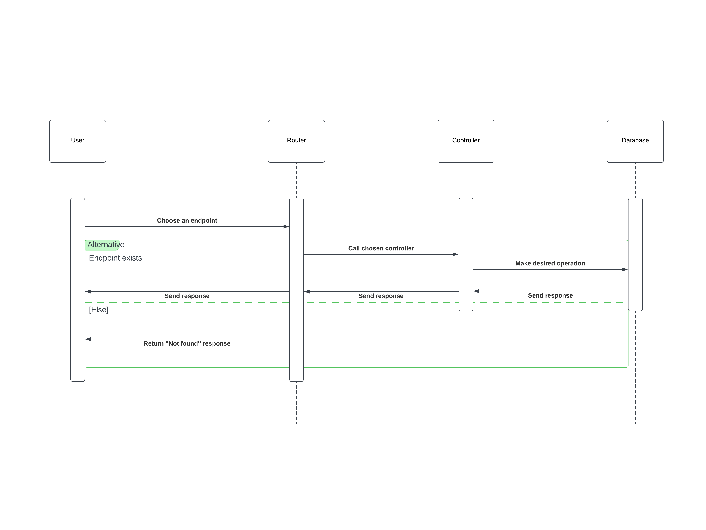

# HNGx Stage Two Task

## Description

A simple REST API capable of CRUD operations on a "person" resource, interfacing with any desired database. The API can dynamically handle parameters, such as adding or retrieving a person.

## Documentation

[Click this link to view documentation](https://documenter.getpostman.com/view/15209718/2s9YC4TXhH)

## UML Diagram

[View diagram online](https://lucid.app/documents/view/23b786d3-5473-4445-8957-fbc4c575ec60)



## Getting started

### Pre-requisites

- Node.js
- MongoDB account

### Installation

1. Clone the repository

    ```shell
    git clone https://github.com/ngchrbn/hngx-task-two
    ```

2. Change to the newly created directory

    ```shell
    cd hngx-task-two/
    ```

3. Install all dependencies

    ```shell
    npm install
    ```

4. Create a .env file to manage the secrets

    ```.env
    PORT=YOUR_PORT
    MONGODB_URI=YOUR_MONGODB_URL
    ```

5. Start the project

    ```shell
    npm run dev
    ```

6. Navigate to <http://localhost:YOUR_PORT> to view the project.
